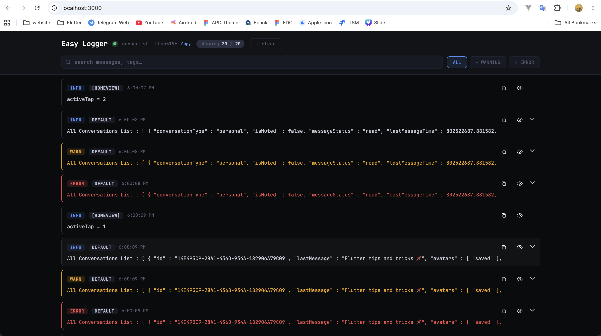
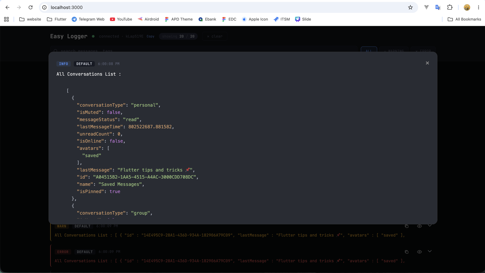

# EasyLoggerServer

A lightweight Node.js server that receives and displays logs from Flutter and SwiftUI apps in real time, powered by Socket.IO.




-----

## Overview

EasyLoggerServer acts as the central hub for the EasyLogger ecosystem. Your mobile app sends log entries over a Socket.IO connection; the server stores them in memory and streams them live to a browser-based dashboard. Logs are automatically evicted when the total buffer exceeds **100 KB**, so the viewer stays responsive during long sessions.

**Client libraries**

|Platform     |Repository                                                                     |
|-------------|-------------------------------------------------------------------------------|
|SwiftUI / iOS|[horlengg/swift-easy-logger](https://github.com/horlengg/swift-easy-logger)    |
|Flutter      |[horlengg/flutter_easy_logger](https://github.com/horlengg/flutter_easy_logger)|

-----

## Requirements

- **Node.js** 18+ (for running directly) — OR — **Docker**
- Your mobile device and the server machine must be on the **same Wi-Fi network**

-----

## Server Setup

The server is a Node.js + Express + Socket.IO app. It binds to your machine’s local IP and a configurable port so your device can reach it over the LAN.

```js
const PORT = process.env.PORT || 3000;
const host = process.env.HOST_IP || "xxxxx"; // Your machine's local IP
const uri  = `http://${host}:${PORT}`;
```

### Option A — Run directly with Node

```bash
# 1. Clone the repo
git clone https://github.com/horlengg/easy-logger-server.git
cd easy-logger-server

# 2. Install dependencies (Express 5, Socket.IO 4)
npm install

# 3a. Start with your machine's local IP
HOST_IP=xx.xx.xx.xx node server.js

# 3b. Or use the default IP hardcoded in server.js
npm start
```

The log viewer UI will be available at `http://<your-ip>:3000` in your browser.

### Option B — Run with Docker

```bash
# Build the image
docker build -t easy-logger-server .

# Run with your local IP passed as an environment variable
docker run -p 3000:3000 -e HOST_IP=xx.xx.xx.xx easy-logger-server
```

The Dockerfile uses `node:18-alpine` and exposes port `3000`.

### Finding your local IP

```bash
# macOS — look for the en0 inet address
ifconfig en0 | grep "inet "
```

Example output: `inet xx.xx.xx.xx netmask 0xffffff00`

Use that IP for both the server startup command **and** the `initialize(...)` call in your client library.

### Environment Variables

|Variable |Default       |Description                  |
|---------|--------------|-----------------------------|
|`HOST_IP`|`xx.xx.xx.xx`|Your machine’s LAN IP address|
|`PORT`   |`3000`        |Port the server listens on   |

-----

## REST API

|Method|Path   |Description                       |
|------|-------|----------------------------------|
|`GET` |`/`    |Serves the log viewer dashboard   |
|`GET` |`/logs`|Returns the full log array as JSON|

-----

## Socket.IO Events

### Events the server receives (from clients)

|Event      |Payload                 |Description                    |
|-----------|------------------------|-------------------------------|
|`send-logs`|`{ tag, type, message }`|Sends a log entry to the server|
|`clear`    |*(none)*                |Clears all logs on the server  |

### Events the server emits (to clients)

|Event           |Payload                                      |Description                                      |
|----------------|---------------------------------------------|-------------------------------------------------|
|`initial-logs`  |`{ logs, uri }`                              |Sent once on connection with existing logs       |
|`new-log`       |`{ id, tag, type, message, timestamp, size }`|Broadcast when a new log entry arrives           |
|`remove-log`    |`id` (string)                                |Broadcast when oldest log is evicted (buffer cap)|
|`clear-all-logs`|*(none)*                                     |Broadcast when all logs are cleared              |

### Log buffer

Logs are stored in memory and capped at **100 KB** total. When the cap is exceeded, the oldest entries are removed one by one and a `remove-log` event is emitted for each, so connected dashboards can keep their UI in sync.

-----

## Client Libraries

### SwiftUI — `swift-easy-logger`

> **Source:** [github.com/horlengg/swift-easy-logger](https://github.com/horlengg/swift-easy-logger)


**Requirements:** iOS 14+, [SocketIO-Client-Swift](https://github.com/socketio/socket.io-client-swift)

**Installation:** Add via Swift Package Manager, then import:

```swift
import EasyLogger
```

**Initialize once at app startup** (use a compile-time flag to disable in production):

```swift
import SwiftUI
import EasyLogger

@main
struct MyApp: App {

    init() {
        EasyLogger.shared.initialize("http://xx.xx.xx.xx:3000", enable: isLoggingEnabled)
    }

    var body: some Scene {
        WindowGroup { ContentView() }
    }

    private var isLoggingEnabled: Bool {
        #if DEBUG
        return true
        #else
        return false
        #endif
    }
}
```

> Logs emitted before the socket connects are **queued** and automatically flushed once the connection is established.

**Logging methods**

All methods accept an optional `tag` (defaults to `"DEFAULT"`) to group related logs.

```swift
EasyLogger.shared.debug("User tapped login button", tag: "Auth")
EasyLogger.shared.warning("Token is about to expire", tag: "Auth")
EasyLogger.shared.error("Failed to parse response",  tag: "Network")
```

**Log a Codable array as formatted JSON**

```swift
let json = EasyLogger.shared.toJSONString(conversations)
EasyLogger.shared.debug("Conversations: <json>\(json ?? "N/A")<json>", tag: "Chat")
```

**Other methods**

```swift
EasyLogger.shared.clear()    // Clears pending (queued) logs and emits `clear` to the server
EasyLogger.shared.dispose()  // Disconnects socket, releases resources (e.g. on logout)
```

**Notes**

- `EasyLogger` is a `@MainActor` singleton — all calls are thread-safe from the main thread.
- Logs are silently dropped when `enable` is `false` with no performance overhead.
- The socket auto-reconnects on disconnect.

-----

### Flutter — `flutter_easy_logger_plus`

> **Source:** [github.com/horlengg/flutter_easy_logger](https://github.com/horlengg/flutter_easy_logger)

Add `flutter_easy_logger` to your `pubspec.yaml`:

```yaml
dependencies:
  flutter_easy_logger_plus: ^<latest-version>
```

**Enable logging with a compile-time flag**
```bash
# Development — logging enabled
flutter run --dart-define=LOG_SERVER_URI=http://10.105.141.142:3000

# Production build — logging disabled (default)
flutter build apk

```


**Logging methods**

All methods accept an optional `tag` (defaults to `"DEFAULT"`) to group related logs.

```swift
EasyLogger().debug("User tapped login button", tag: "Auth")
EasyLogger().warning("Token is about to expire", tag: "Auth")
EasyLogger().error("Failed to parse response",  tag: "Network")
```

**Log a Codable array as formatted JSON**

```swift
final apiResponseStr = EasyLogger.instance.toJSONString(apiResponse);
EasyLogger().debug("API Response: <json>$apiResponseStr<json>", tag: "API");
```

**Other methods**

```swift
EasyLogger().clear()    // Clears pending (queued) logs and emits `clear` to the server
EasyLogger().dispose()  // Disconnects socket, releases resources (e.g. on logout)
```

**Log types**

|Type      |Raw Value|Use case                         |
|----------|---------|---------------------------------|
|`.debug`  |`0`      |General info, state changes      |
|`.warning`|`1`      |Non-critical issues, deprecations|
|`.error`  |`2`      |Failures, exceptions             |


-----

## Architecture

```
┌──────────────────────┐        Socket.IO (LAN)        ┌─────────────────────────┐
│   iOS / Flutter app  │  ──── send-logs ────────────▶  │                         │
│   (EasyLogger SDK)   │  ◀─── new-log / remove-log ──  │   easy-logger-server    │
└──────────────────────┘                               │   (Node.js + Express +  │
                                                        │    Socket.IO)           │
┌──────────────────────┐        HTTP / WebSocket        │                         │
│   Browser dashboard  │  ◀──── initial-logs ─────────  │                         │
│   (Log viewer UI)    │  ◀──── new-log / clear ──────  └─────────────────────────┘
└──────────────────────┘
```

-----

## License

MIT


## Contact Me

If you have any questions, suggestions, or issues, feel free to reach out via my website:

👉 [Website](https://horleng.vercel.app)